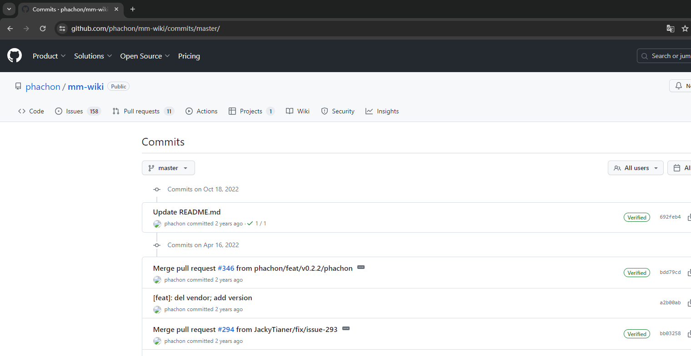
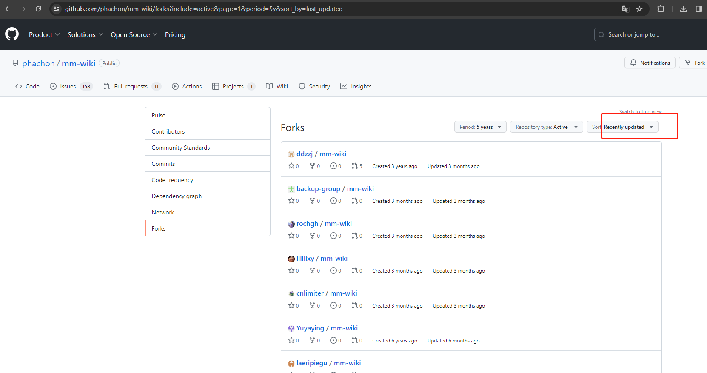
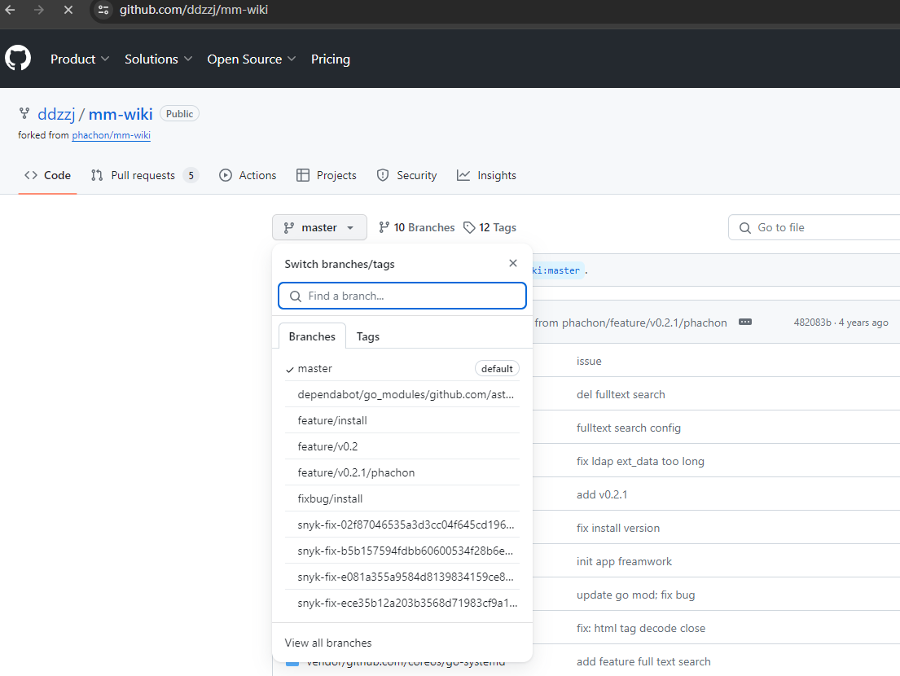
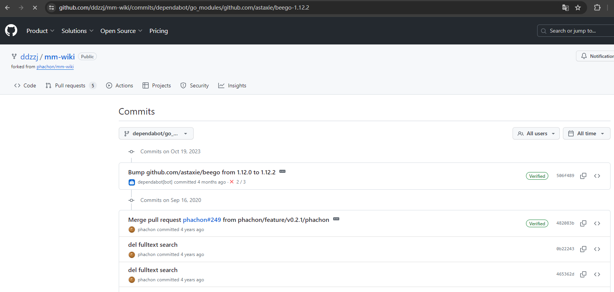

# 前言
经常关注一些github项目的人都知道，一些比较不错的项目经常会存在一些二开大牛，但可能主项目已经停更导致大牛的代码只能个人用。现在我想知道哪些大牛做了一些二开，只能通过主项目的fork上一条一条看，手工太麻烦了，所以简单写了个脚本跑跑看。

## 手工

以mm-wiki为例吧，原本就是想看这个项目大牛更新

### 第一步: 打开主项目的更新历史

url: `https://github.com/phachon/mm-wiki/commits/master/`



可以看到最新更新为 2022年10月18日

### 第二步: 查看主项目的forks历史



这里有三个选项

```
Period: 5years   // 表示最近五年
Repository type: Active  // 表示活跃的项目
Sort: Recently updated  // 表示最近更新
```

当前日期是2024年2月，距离上次更新不过2年，因此可以只看最近2年的就行

### 第三步: 确认forks项目的分支

```
https://github.com/ddzzj/mm-wiki/
```




### 第四步： 查看各个分支的最新更新时间

```
https://github.com/ddzzj/mm-wiki/commits/dependabot/go_modules/github.com/astaxie/beego-1.12.2
```



## 脚本

我使用requests和selenium模块分别写了三个代码，凑合用

```
request_main.py		//纯requests模块，第四步失败率较大
selenium_main.py	//纯selenium模块，速度较慢，最稳定
combination_main.py	//第四步使用selenium，理论上会比纯selenium快
```


